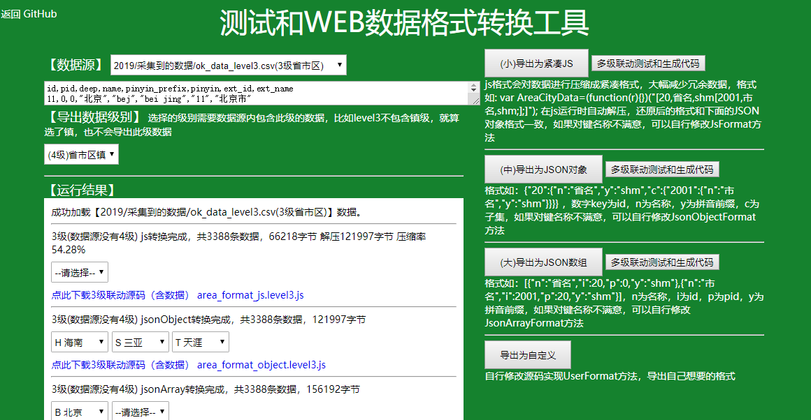
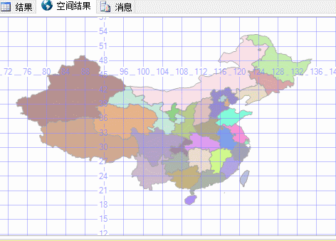
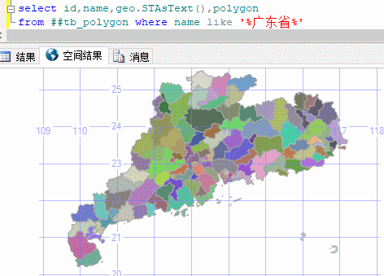

# :open_book:省市区数据采集并标注拼音、坐标和边界范围

当前最新版为`2019文件夹`内的`2018版数据`，此数据发布于`2019-01-31`；在线测试数据（多级联动）：[https://xiangyuecn.github.io/AreaCity-JsSpider-StatsGov/](https://xiangyuecn.github.io/AreaCity-JsSpider-StatsGov/)。

可直接打开`采集到的数据`文件夹内的`ok_data_level4.csv`来使用，level4是省市区镇4级数据，level3是省市区3级数据。另外不需要的数据可以简单的用Excel筛选后直接删除。csv格式非常方便解析或导入数据库。

`ok_geo.csv.7z`为省市区3级的坐标和行政区域边界范围数据，csv格式，解压后130M+。

> 如果在使用csv文件过程中出现乱码、错乱等情况，请自行调对utf-8编码（或者使用文本编辑器 `如notepad++` 把文件转成需要的编码），文本限定符为`"`。
> 
> 数据已测试在: `win10`+`notepad++`+`UltraEdit`+`WPS`+`SQL Server` 中无需任何设置，全部都能直接打开，并且数据保持工整，没有发现异常情况。
> 
> csv导入数据库中本来就是复杂的事情，参考`3_格式化.js` 中在SQL Server中的导入流程。

## 数据源

- 国家统计局 > 统计数据 > 统计标准 > [统计用区划和城乡划分代码](http://www.stats.gov.cn/tjsj/tjbz/tjyqhdmhcxhfdm/)

- 高德地图坐标和行政区域边界范围

## 采集环境

chrome 控制台，`41.0.2272.118`这版本蛮好，新版本乱码、SwitchyOmega代理没有效果、各种问题（[简单制作chrome便携版实现多版本共存](https://github.com/xiangyuecn/Docs/blob/master/Other/%E8%87%AA%E5%B7%B1%E5%88%B6%E4%BD%9Cchrome%E4%BE%BF%E6%90%BA%E7%89%88%E5%AE%9E%E7%8E%B0%E5%A4%9A%E7%89%88%E6%9C%AC%E5%85%B1%E5%AD%98.md)）

## 采集深度

- 2019文件夹采集了4层，省、市、区、镇，[2018版数据](http://www.stats.gov.cn/tjsj/tjbz/tjyqhdmhcxhfdm/2018/index.html)。采集高德省市区三级坐标和行政区域边界范围。
- 2018文件夹采集了3层，省、市、区，[2017版数据](http://www.stats.gov.cn/tjsj/tjbz/tjyqhdmhcxhfdm/2017/index.html)。
- 2017文件夹采集了3层，省、市、区，[2016版数据](http://www.stats.gov.cn/tjsj/tjbz/tjyqhdmhcxhfdm/2016/index.html)。
- 2013文件夹采集了4层，省、市、区、镇，[2013版数据](http://www.stats.gov.cn/tjsj/tjbz/tjyqhdmhcxhfdm/2013/index.html)。

## ok_data表字段
省市区镇数据表。

字段|描述
:--:|--
id|统计局的编号经过去除后缀的`0{3,6,8}`得到的短编号；如果是添加的港澳台等数据，此编号为自定义编号。
pid|上级ID
deep|层级深度，0：省，1：市，2：区，3：镇。
name|城市名称，为统计局的名称精简过后的。
pinyin_prefix|`name`的拼音前缀，取的是第一个字前两个字母和后两个字首字母组成的。
pinyin|`name`的完整拼音。
ext_id|统计局原始的编号；如果是添加的港澳台等数据，此编号为0。
ext_name|原始名称，为未精简的名称。

## ok_geo表字段
此表为坐标和行政区域边界范围数据表，因为数据文件过大（130M+），所以分开存储。

字段|描述
:--:|--
id|和`ok_data`表中的`ID`相同，通过这个`ID`关联到省市区具体数据，`map_geo_格式化.js`中有数据合并SQL语句。
geo|城市中心坐标，高德地图`GCJ-02`火星坐标系
polygon|行政区域边界，高德地图`GCJ-02`火星坐标系。存在多个地块时用`;`分隔，每个地块的坐标点用` `空格分隔，特别要注意：多个地块组合在一起可能是`MULTIPOLYGON`或者`POLYGON`，需用工具进行计算和对数据进行验证。js没找到求`polygon`并集的方法。

# :open_book:测试和WEB数据格式转换工具

在线测试工具地址：[https://xiangyuecn.github.io/AreaCity-JsSpider-StatsGov/](https://xiangyuecn.github.io/AreaCity-JsSpider-StatsGov/)

或者直接使用`测试和WEB数据格式转换工具.js`，在任意网页控制台中使用。

此工具主要用于把csv数据转换成别的格式，另外提供省市区多级联动测试，并且可生成js源码（含数据）下载，3级联动生成的文件紧凑版68kb，4级联动紧凑版1mb大小。

## 工具支持：
1. 数据预览和测试。
2. 将csv数据导出成压缩后的紧凑版js格式纯数据文件，省市区3级数据65kb大小。
3. 将csv数据导出成JSON对象、JSON数组纯数据文件，省市区3级数据120kb+。
4. 网页版省市区镇多级联动测试。
5. 网页版省市区多级联动js代码生成（含数据）。

## 效果图

# :open_book:拼音标注

## 拼音源
省市区这三级采用在线拼音工具转换，据说依据《新华字典》、《现代汉语词典》等规范性辞书校对，多音字地名大部分能正确拼音，`重庆`->`chong qing`，`朝阳`->`chao yang`，`郫都`->`pi du`，`闵行`->`min hang`，`康巴什`->`kang ba shi`。

镇级以下地名采用本地拼音库（`.pinyin-python-server`）转换，准确度没有省市区的高。

## 拼音前缀
从完整拼音中提取的拼音前缀，取的是第一个字前两个字母和后两个字首字母，意图是让第一个字相同名称的尽量能排序在一起。排序1：`黑龙江helj、湖北hub、湖南hun`；排序2：`湖北hb、黑龙江hlj、湖南hn`，排序一胜出。

# :open_book:坐标和行政区域边界范围

## 数据源
使用高德接口采集的，本来想采百度地图的，但经过使用发现百度地图数据有严重问题：

参考 `肃宁县（右下方向那块飞地）`、`路南区（唐山科技职业技术学院那里一段诡异的边界）` 边界，百度数据大量线段交叉的无效`polygon`（[百度地图测试](http://lbsyun.baidu.com/jsdemo.htm#c1_10)），没有人工无法修正，高德没有这个问题（[高德地图测试](https://lbs.amap.com/api/javascript-api/example/district-search/draw-district-boundaries)）；

并且高德对镂空性质的地块处理比百度强，参考`天津市`对`唐山`大块飞地的处理，高德数据只需要`Union`操作就能生成`polygon`，百度既有`Union`操作又有`Difference`操作，极其复杂数据还无效。

所以放弃使用百度地图数据。

## 如何使用坐标和边界数据

`坐标和边界数据` 和 `省市区` 数据是分开存储的，通过`ID`来进行关联。

可以把`ok_geo.csv`导入到数据库内使用，由于`POLYGON`需要解析，蛮复杂的，可以参考[2019/map_geo_格式化.js](https://github.com/xiangyuecn/AreaCity-JsSpider-StatsGov/blob/master/2019/%E5%9D%90%E6%A0%87%E5%92%8C%E8%BE%B9%E7%95%8C/map_geo_%E6%A0%BC%E5%BC%8F%E5%8C%96.js)内的SQL Server导入用的SQL语句的例子。

如果需要特定的`POLYGON`格式，可以根据上面介绍的字段格式，自行进行解析和验证。

使用过程中如果遇到多种不同坐标系的问题，比如请求的参数是`WGS-84坐标(GPS)`，我们后端存储的是高德的坐标，可以通过将`WGS-84坐标`转成`高德坐标`后进行处理，百度的坐标一样。转换有相应方法，转换精度一般可以达到预期范围，可自行查找。或者直接把高德的原始坐标数据转换成目标坐标系后再存储（精度？）。

## 边界效果预览

 

# :open_book:数据问题

1. id编号和国家统计局的编号基本一致，方便以后更新，有很多网站接口数据中城市编号是和这个基本是一致的。

2. `东莞`、`中山`、`儋州`等没有第三级区级，自动添加同名的一级作为区级，以保证整个数据结构的一致性，添加的区以上级的ID结尾加两个0作为新ID，此结构ID兼容性还不错，比如：东莞（4419）下级只有一个区 东莞（441900）。

3. 地区名字是直接去掉常见的后缀进行精简的，如直接清除结尾的`市|区|县|街道办事处|XX族自治X`，数量较少并且移除会导致部分名字产生歧义的后缀并未精简。

4. 2017版开始数据结尾添加了自定义编号的`港澳台` `90`、`海外` `91`数据，此编号并非标准编码，而是整理和参考标准编码规则自定义的，方便用户统一使用（注：民政部的台港澳编码为71、81、82）。

5. 参考链接：[统计用区划代码和城乡划分代码编制规则](http://www.stats.gov.cn/tjsj/tjbz/200911/t20091125_8667.html)，[民政部发布的行政区划代码](http://www.mca.gov.cn/article/sj/xzqh/)。

6. 2019版开始从高德采集了省市区三级坐标和行政区域边界范围数据，省市区总计3300+条数据，未采集到边界的有160条以内。关于未获取到坐标或边界的城市，本采集方案采取不处理策略，空着就空着，覆盖主要城市和主要人群，未覆盖区域实际使用过程中应该进行降级等处理。比如：尽最大可能的根据用户坐标来确定用户所在城市，因为存在没有边界信息的区域，未匹配到的应使用ip等城市识别方法。

## 2019修正数据

- [issues/2](https://github.com/xiangyuecn/AreaCity-JsSpider-StatsGov/issues/2) `乐亭县` 的 `乐`读`lào` ，此县下面的`乐亭`读音均已修正。

# :open_book:使用js自行采集

在低版本chrome控制台内运行1、2、3打头的文件即可完成采集，前提是指定网页打开的控制台。这三个文件按顺序执行。

最新采集代码内对拼音转换的接口变化蛮大，由于优秀的那个公网接口采取了IP限制措施，就算使用了全自动的切换代理，全量转换还是极为缓慢，因此采用了本地转换接口和公网转换接口结合的办法，省市区三级采用公网接口，其他的采用本地接口。公网接口转换的正确度极高，本地的略差那么一点。

## 步骤1

1. 打开国家统计局任页面 http://www.stats.gov.cn/tjsj/tjbz/tjyqhdmhcxhfdm/。
2. 控制台内粘贴`1_抓取国家统计局城市信息.js`代码执行。
3. 采集完成自动弹出下载，保存得到文件`data.txt`。

## 步骤2

1. [可选]启动`.pinyin-python-server`中的本地拼音服务，根据`2_1_抓取拼音.js`中的提示对4级进行本地拼音转换。
2. 根据`2_2_抓取拼音.js`开头注释打开拼音接口页面，然后导入数据，进行省市区3级进行高准确度拼音转换。
3. 拼音采集完成自动弹出下载，保存得到文件`data-pinyin.txt`。

## 步骤3

1. 任意页面，最好是第二步这个页面，根据`3_格式化.js`中的提示导入`data-pinyin.txt`，并执行代码。
2. 格式化完成自动弹出下载，保存得到最终文件`ok_data.csv`。

## 坐标和行政区域边界采集

使用`坐标和边界`目录内的`map_geo.js`、`map_geo_格式化.js`在[高德地图测试页面](https://lbs.amap.com/api/javascript-api/example/district-search/draw-district-boundaries)，根据文件内的说明即可完成采集。

# :star:捐赠
如果这个库有帮助到您，请 Star 一下。

你也可以选择使用支付宝给我捐赠：

  
